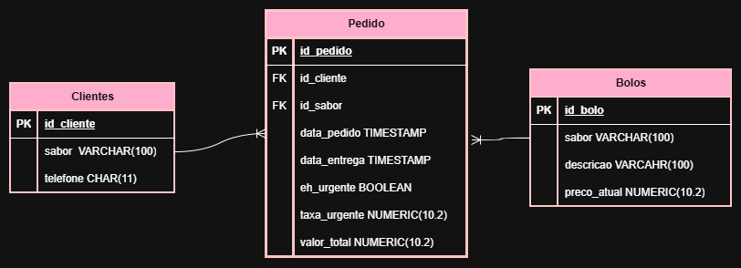

# Bolos da Neide
A cliente do projeto é Valdeneide dos Santos Moreira
O sistema deve ter uma interface facil de ser interpretada. O sistema deve permitir cadastro para os cliente fazer encomenda. E por fim o sistema deve fornecer informções do produto para o cliente conseguir realizar sua compra.

## Mer
### Clientes
- id_cliente PK
- nome VARCHAR(100)
telefone CHAR(11)

### Bolos
- id_bolo PK
- sabor VARCHAR(100)
- descricao VARCHAR(100)
- preco_atual: NUMERIC(10,2)

### Pedidos
- id_pedido PK
- id_cliente FK
- id_sabor FK
- data_pedido TIMESTAMP
- data_entrega TIMESTAMP
- eh_urgente BOOLEAN
- taxa_urgente NUMERIC (10.2)
- valor_total NUMERIC (10.2)

## Der

